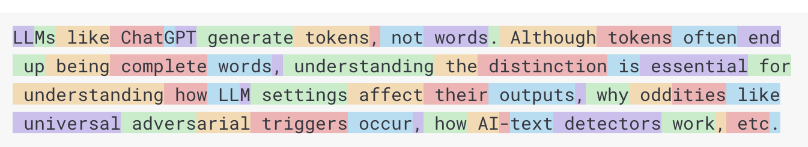

## Model

Los modelos de IA son algoritmos diseñados para procesar y generar información, estos modelos pueden hacer predicciones, texto, imágenes u otros resultados.

## Prompt

Los prompts en términos simples, son los datos de entrada que le damos a nuestro modelo de IA

### Prompt templates

Para crear prompts efectivos se pueden utilizar plantillas con cierta estructura de palabras, con esto remplazando ciertos valores podremos tener una respuesta adecuada a nuestras necesidades. Por Ejemplo

```markdown
Tell me a {adjective} joke about {content}.
```

## Embeddings

Los embeddings son representaciones numéricas de textos, imágenes o videos que poseen relaciones entre los datos

> [!info]
>
> En un principio no es necesario tener un entendimiento completo de las intrincadas matemáticas de esto, pero una comprensión básica del tema y su función dentro de los sistemas de IA bastará


Embeddings son relevantes en aplicaciones prácticas cómo el patron Retrieval Augmented Generation (RAG).

## Tokens

Los tokens sirven como bloques de construcción de como trabaja un modelo de IA. Al recibir la información, los modelos convierten las palabras en tokens, Al entregar la información los tokens se convierten en palabras.



Lo más importante es que los Tokens = Dinero. Ambos, los inputs y outputs contribuyen al conteo general de tokens

También los modelos están sujetos a un límite de tokens. Este límite es conocido como “context window”. El modelo no procesa el texto que excede al límite

> [!tip]
>
> El consumo de tokens actualmente es más eficiente para el idioma inglés

## Structured Output

La salida de un modelo de IA tradicionalmente es un String, incluso aunque pidas un JSON. Puede ser correctamente un JSON, pero no es una estructura de datos JSON al 100%. Por lo tanto, pedir un JSON no tiene una precisión del 100%.

Por lo tanto, se han generado prompts que ayudan a convertir un simple string en estructuras de datos acordes para la integración de aplicaciones.

Más info [Structured output conversion](https://docs.spring.io/spring-ai/reference/api/structured-output-converter.html#_structuredoutputconverter) 


> [!info]
>
> Para más información https://docs.spring.io/spring-ai/reference/concepts.html

