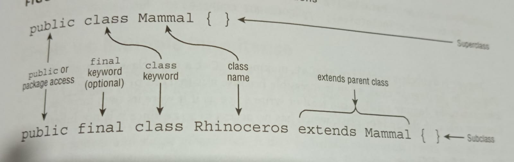

- Una _superclass_ no tiene nada de particular para ser heredable, solo no debe ser final.
- La herencia es **transitiva**. Dado tres clases (X, Y, Z),  sí X extiende Y, de la misma forma Y extiende Z, entonces X es considerada una subclass o descendiente de Z. De la misma forma Z es ancestro o una superclass de X.
    - Se puede usar el término direct subclass o descendiente para indicar que una clase extiende directamente de otra.
- Cuándo una clase hereda de una clase padre, todos los miembros `public` y `protected` quedan automáticamente disponibles en la subclass
- Si dos clases están en el mismo paquete los miembros `package` estarán disponibles en la clase hija.
- Los miembros `private` están disponibles solamente en la clase que se definieron. Esto no quiere decir que no se pueda modificar el comportamiento de estos elementos desde una subclase, solo que no se tendrá acceso directo a ellos.